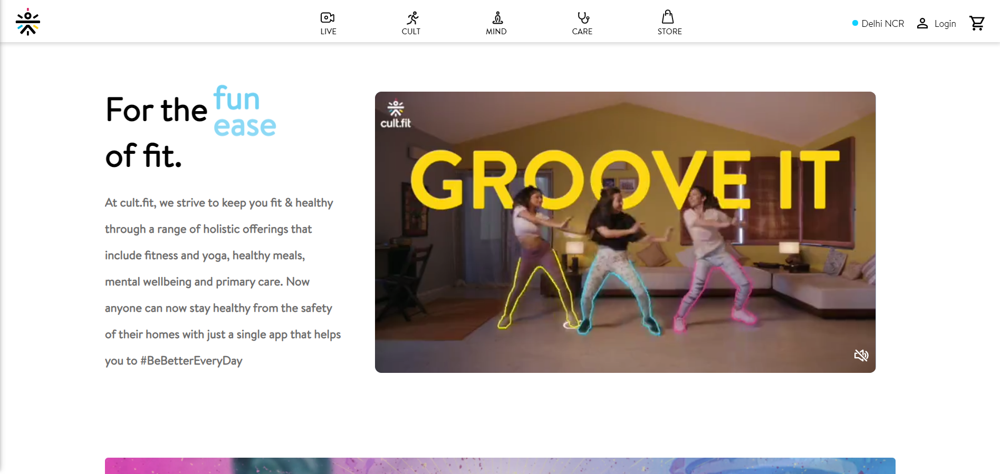
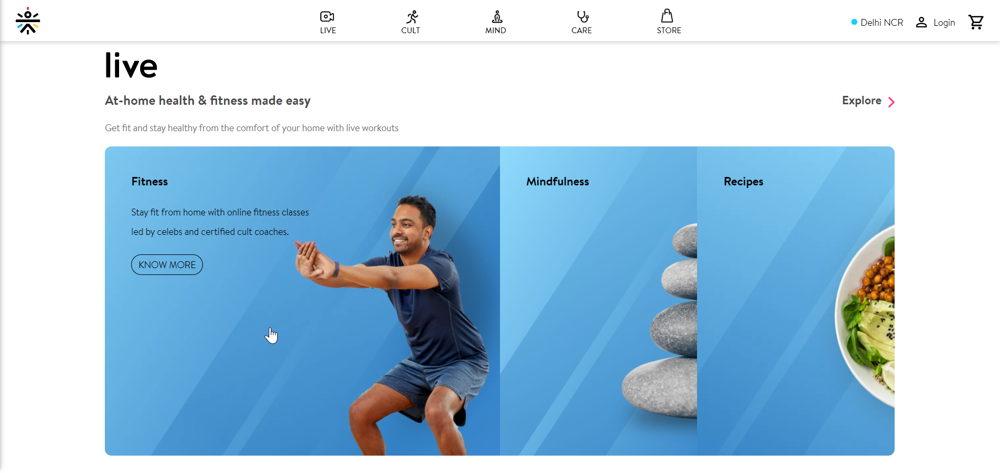
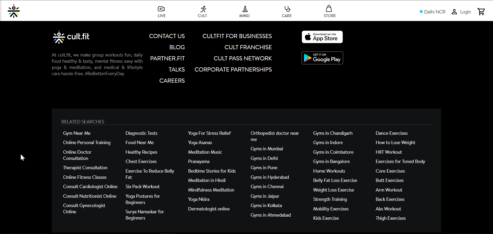
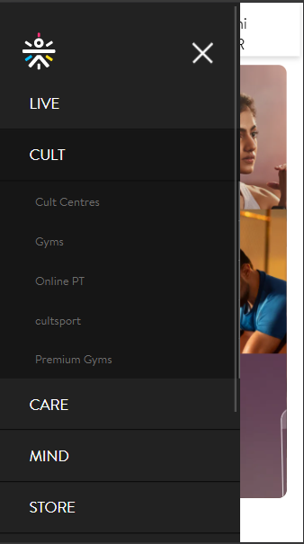

<h1 align="center">
<br>
<a href="https://github.com/shivang02/FaceMouse"></a>
<br>
  cult.fit <i>clone</i>
  <br>
</h1>

<h4 align="center">A responsive frontend clone of the  cult.fit website</h4>

<div align="center">
<code></code>
<code></code>
<code></code>
</div>
<p align="center">
  <a href="#screenshots">Screenshots</a> •
  <a href="#how-to-use">How To Use</a> •
  <a href="#license">License</a>
</p>


## Screenshots

- **Desktop**<br>

<br>

<br>


- **Mobile**<br>

<br>

<br>


## How To Use

Clone this repository and open index.html<br>
From your command line:

```bash
# Clone this repository
$ git clone https://github.com/shivang02/cult.fit_clone

# Go into the repository
$ cd cult.fit_clone

# Run the app
$ open index.html 
```

## License

MIT

---

> GitHub &nbsp;&middot;&nbsp; [@shivang02](https://github.com/shivang02)